# Mysql报错注入原理分析

<sub>*
对乌云[Mysql报错注入原理分析(count()、rand()、group by)](http://wooyun.jozxing.cc/static/drops/tips-14312.html)学习，对其做下记录

## 疑问

一直在用mysql数据库报错注入方法，但为何会报错？  

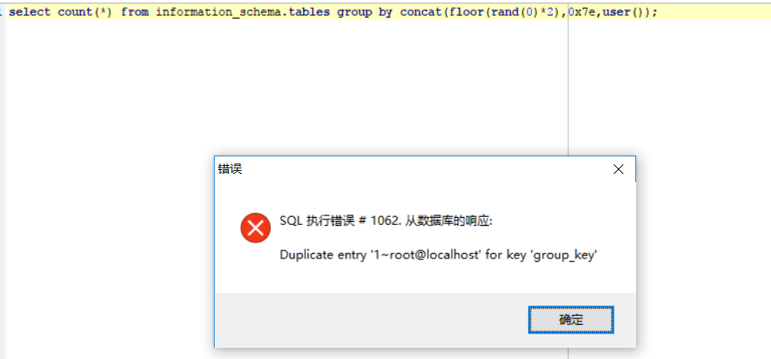

## 位置问题?


```sql
select count(*),(floor(rand(0)*2))x from information_schema.tables group by x; 
```


这是网上最常见的语句,目前位置看到的网上 sql 注入教程, floor 都是直接放 count(*) 后面，为了排除干扰，我们直接对比了两个报错语句，如下图：

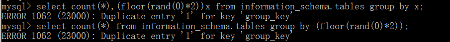

由上可知报错跟位置无关。


## 绝对报错还是相对报错？


```sql
select count(*),(floor(rand(0)*2))x from information_schema.tables group by x; 
```


这条语句是不是一定报错呢，user 表中插入一条数据  

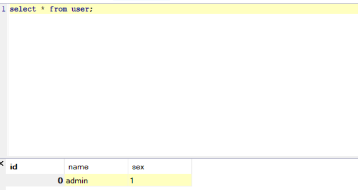

可以看到不会报错  

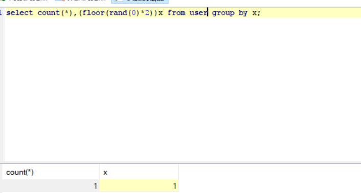

再插入一条数据，依然没有报错  

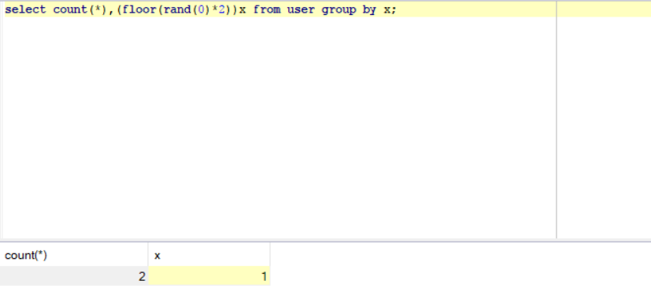

继续插入数据，报错  

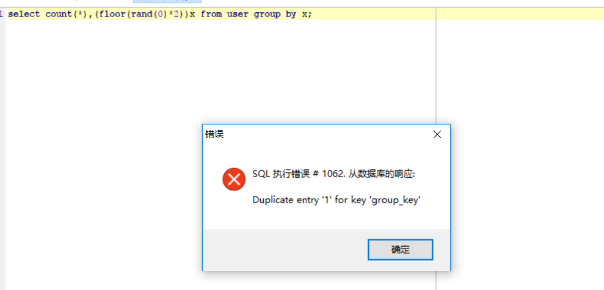

说明

```sql
select count(*),(floor(rand(0)*2))x from information_schema.tables group by x; 
```

报错需要3条和3条以上数据

## 随机因子具有决定权么(rand()和rand(0))

为了更彻底的说明报错原因，直接把随机因子去掉，再来一遍看看，先看一条记录的时候，如下图:  

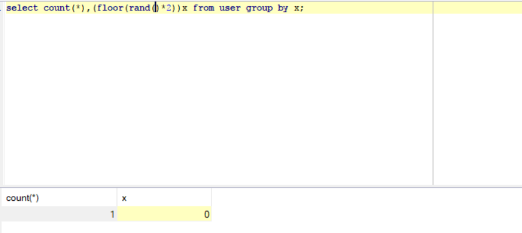

一条数据的时候 x 值不断变化，但是不会报错  

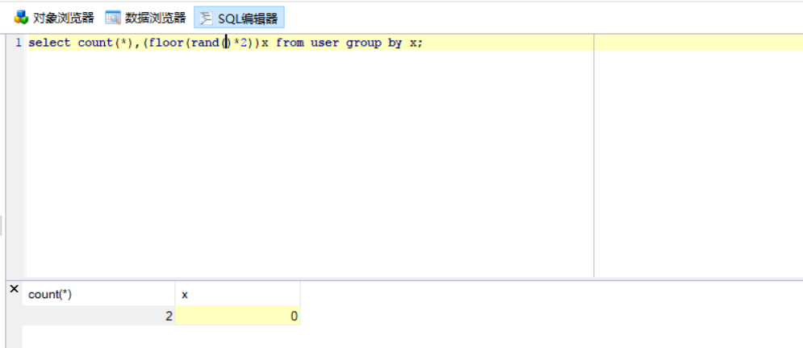

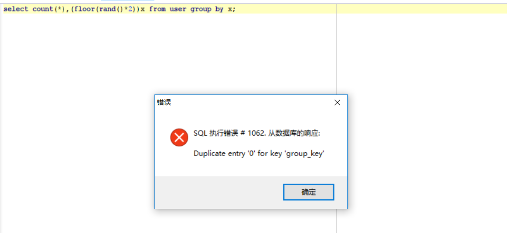

插入一条数据，报错是随机的  

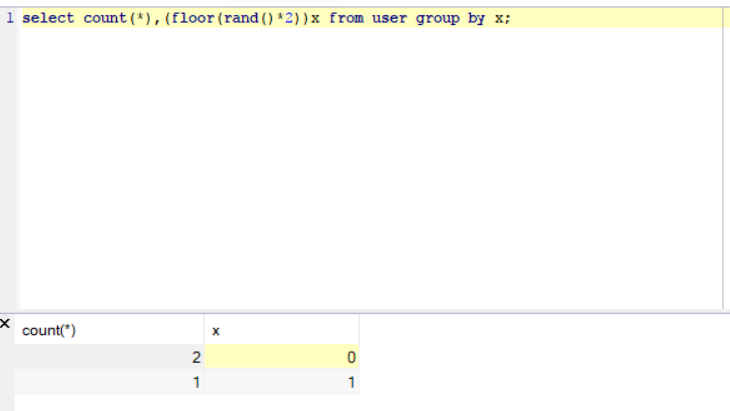

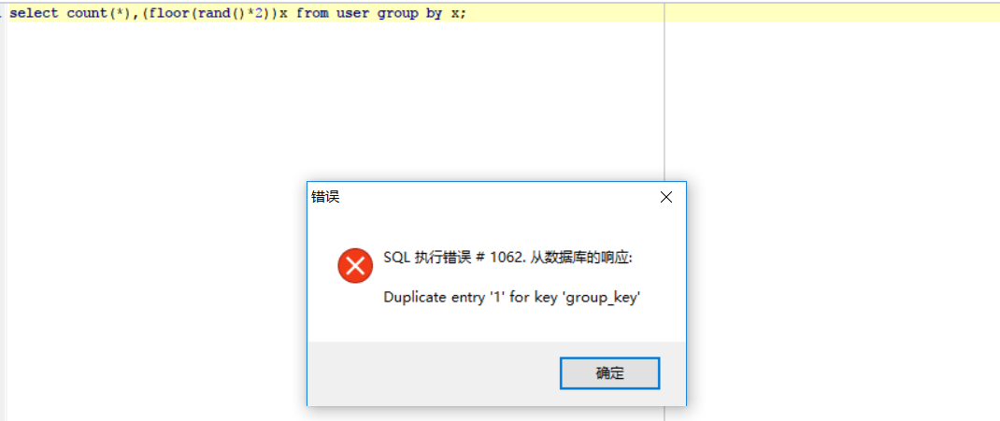

再插入一条记录，三条记录看一下，报错也是随机的

由此可见报错和随机因子是有关联的，但有什么关联呢，为什么直接使用 rand() ，有两条记录的情况下就会报错，而且是有时候报错，有时候不报错，而 rand(0) 的时候在两条的时候不报错，在三条以上就绝对报错？我们继续往下看。

## 不确定性与确定性

前面说过，`floor(rand(0)*2)`报错的原理是恰恰是由于它的确定性，这到底是为什么呢？从 0x04 我们大致可以猜想到，因为`floor(rand()*2)`不加随机因子的时候是随机出错的，而在 3 条记录以上用`floor(rand(0)*2)`就一定报错，由此可猜想`floor(rand()*2)`是比较随机的，不具备确定性因素，而`floor(rand(0)*2)`具备某方面的确定性。

为了证明我们猜想，分别对`floor(rand()*2)`和`floor(rand(0)*2)`在多记录表中执行多次(记录选择 10 条以上)，在有 12条 记录表中执行结果如下图：

```sql
select floor(rand()*2) from user;
```

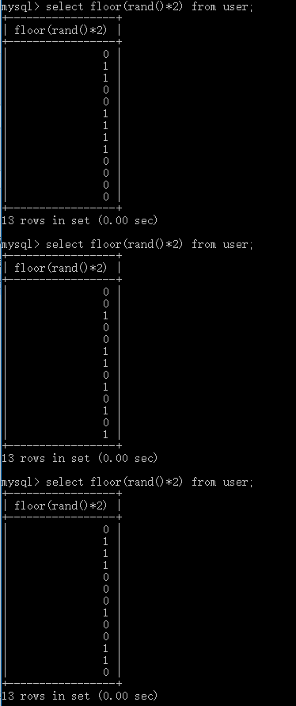

对比三次查询发现`floor(rand()*2)`是随机的,接下来看`floor(rand(0)*2)`

```sql
select floor(rand(0)*2) from user;
```

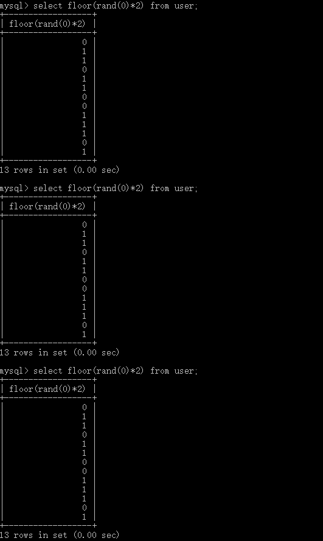

可以看到`floor(rand(0)*2)`是有规律的，而且是固定的，这个就是上面提到的由于是确定性才导致的报错，那为何会报错呢，我们接着往下看。

## count 与 group by 的虚拟表]

使用`select count(*) from user group by x;`这种语句的时候我们经常可以看到下面类似的结果：
  
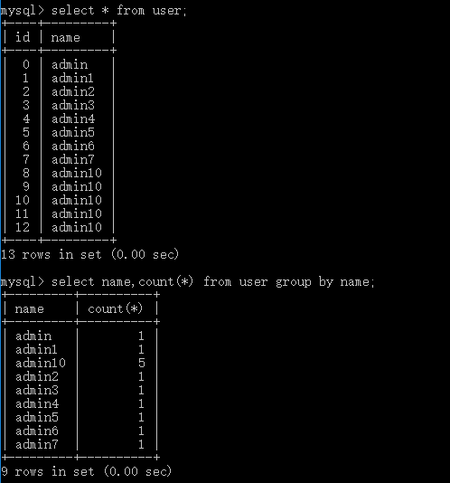

可以看出admin10的记录有5条


与 count(*) 的结果相符合，那么 mysql 在遇到`select count(*) from user group by x;`这语句的时候到底做了哪些操作呢，我们果断猜测 mysql 遇到该语句时会建立一个虚拟表(实际上就是会建立虚拟表)，那整个工作流程就会如下图所示：


1.先建立虚拟表，如下图(其中 key 是主键，不可重复):  


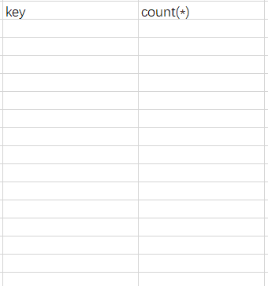
 
2.开始查询数据，取数据库数据，然后查看虚拟表存在不，不存在则插入新记录，存在则 count(*) 字段直接加 1，如下图: 
 
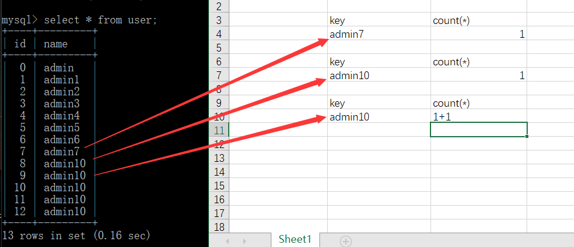
 
由此看到如果 key 存在的话就加 1， 不存在的话就新建一个 key。
那这个和报错有啥内在联系，我们直接往下来，其实到这里，结合前面的内容大家也能猜个一二了。

## floor(rand(0)\*2) 报错

其实 mysql 官方有给过提示，就是查询的时候如果使用 rand() 的话，该值会被计算多次，那这个“被计算多次”到底是什么意思，就是在使用 group by 的时候，floor(rand(0)*2) 会被执行一次，如果虚表不存在记录，插入虚表的时候会再被执行一次，我们来看下 floor(rand(0)*2) 报错的过程就知道了，从 0x04 可以看到在一次多记录的查询过程中 floor(rand(0)*2) 的值是定性的，为`011011…`(记住这个顺序很重要)，报错实际上就是 floor(rand(0)*2) 被计算多次导致的，具体看看`select count(\*) from user group by floor(rand(0)\*2);`的查询过程：

1.查询前默认会建立空虚拟表如下图:  


2.取第一条记录，执行 floor(rand(0)*2) ，发现结果为 0 (第一次计算),查询虚拟表，发现 0 的键值不存在，则 floor(rand(0)*2) 会被再计算一次，结果为 1 (第二次计算)，插入虚表，这时第一条记录查询完毕，如下图:
  
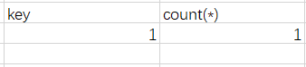
 
3.查询第二条记录，再次计算 floor(rand(0)*2) ，发现结果为 1 (第三次计算)，查询虚表，发现 1 的键值存在，所以 floor(rand(0)*2) 不会被计算第二次，直接 count(*) 加 1，第二条记录查询完毕，结果如下:  

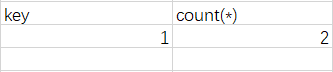
 
4.查询第三条记录，再次计算 floor(rand(0)*2)，发现结果为 0 (第 4 次计算)，查询虚表，发现键值没有 0，则数据库尝试插入一条新的数据，在插入数据时 floor(rand(0)*2) 被再次计算，作为虚表的主键，其值为 1 (第 5 次计算)，然而1这个主键已经存在于虚拟表中，而新计算的值也为 1 (主键键值必须唯一)，所以插入的时候就直接报错了。

5.整个查询过程 floor(rand(0)*2) 被计算了 5 次，查询原数据表 3 次，所以这就是为什么数据表中需要 3 条数据，使用该语句才会报错的原因。  

|floor(rand(0)*2) |  |
| - | :-: |
|0 |	select (不存在)  第一条数据 |
|1 |	insert (插入，count(*)为1)  第一条数据 |
|1 |	select (存在，直接count(*),这时key为1的count(*)值为2)  第二条数据 |
|0 |	select (不存在)  第三条数据 |
|1 |	insert (插入，存在，同key为1主键唯一冲突，报错)  第三条数据 |


同样的

floor(rand(4)*2)  

 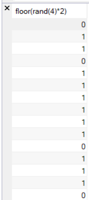

也是三条数据就会报错

floor(rand(11)*2)  

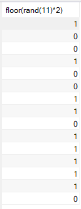

 
|floor(rand(11)*2) |  |	
| - | :-: |
|1 |	select (不存在)&nbsp;&nbsp;第一条数据|
|0 |	insert (插入，count(*)为1)&nbsp;&nbsp;第一条数据|
|0 |	select (存在，直接count(*),这时key为0的count(\*)为2)  第二条数据|
|1 |	select (不存在)  第三条数据|
|0 |	insert (插入，存在，同key为1主键唯一冲突，报错)  第三条数据|

而 rand(1) , rand(2) 这种的就不会报错了
  
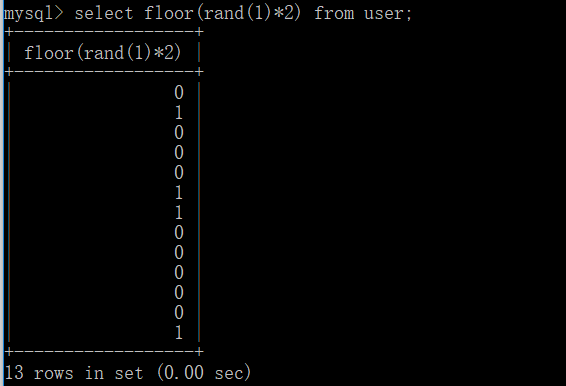  

|floor(rand(1)*2) |  |
| - | :-: |
|0 |	select (不存在)  第一条数据 |
|1 |	insert (插入，count(*)为1)  第一条数据 |
|0 |	select (不存在)  第二条数据 |
|0 |	insert (插入，count(*)为1)  第二条数据 |
|0 |	select (存在，key为0的值count(*)加1)  第三条数据 |


这里为什么使用 count() 这个函数呢，首先我们知道 count() 为聚合函数，类似的 sum() 也为聚合函数，sum()代替 count()，同样可以达到报错注入的效果

常见的聚合函数还有 AVG()，MAX()，MIN()
  
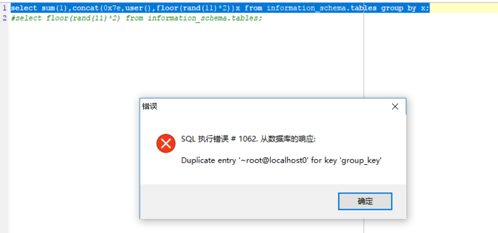

## 总结
通过上面我们知道Mysql报错注入不一定通过

```sql
select count(*),(floor(rand(0)*2))x from information_schema.tables group by x; 
```
rand(0) 可以替换为 rand(4),rand(11)。count(*) 可以替换成其他聚合函数。同样能够达到报错注入的效果。


