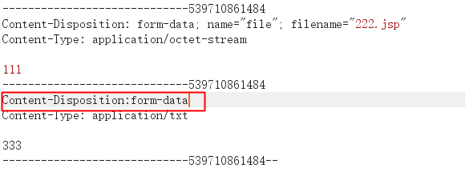
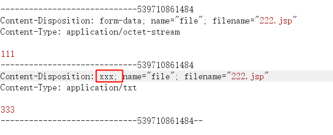
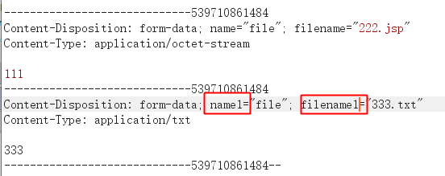

# Jfinal 任意文件上传分析

## **前言**

freebuf 上看到一处任意文件上传绕过，对其简单做了分析，记录一下。

## **漏洞分析**

框架上传文件调用函数

```UploadFile upfile = getFile("file","test");```

调用 ```\com\jfinal\jfinal\4.3\jfinal-4.3.jar!\com\jfinal\core\Controller.class``` 类下的 ```getFile(String parameterName, String uploadPath) ``` 方法。

```java
public UploadFile getFile(String parameterName, String uploadPath) {
    this.getFiles(uploadPath);
    return this.getFile(parameterName);
}
```

接着调用该类的 ```getFiles``` 方法，根据方法名可知这里可以上传多个文件。

```java
public List<UploadFile> getFiles(String uploadPath) {
    if (!(this.request instanceof MultipartRequest)) {
        this.request = new MultipartRequest(this.request, uploadPath);
    }

    return ((MultipartRequest)this.request).getFiles();
}
```


这里做了 ```if``` 判断，看 ```request``` 是否为 ```MultipartRequest``` 的实例。进入 ```if``` 代码块执行。创建了 ```MultipartRequest``` 实例，并把请求 ```request``` 和 ```uploadPath``` 传入。
```\com\jfinal\jfinal\4.3\jfinal-4.3.jar!\com\jfinal\upload\MultipartRequest.class```

```java
public MultipartRequest(HttpServletRequest request, String uploadPath) {
    super(request);
    this.wrapMultipartRequest(request, this.getFinalPath(uploadPath), maxPostSize, encoding);
}
```


调用 ```super``` 方法为 ```request``` 变量赋值。

```java
public ServletRequestWrapper(ServletRequest request) {
    if (request == null) {
        throw new IllegalArgumentException("Request cannot be null");
    } else {
        this.request = request;
    }
}
```

接下来调用该类的 ```wrapMultipartRequest``` 方法。

```java
private void wrapMultipartRequest(HttpServletRequest request, String uploadPath, int maxPostSize, String encoding) {
    File dir = new File(uploadPath);
    if (!dir.exists() && !dir.mkdirs()) {
        throw new RuntimeException("Directory " + uploadPath + " not exists and can not create directory.");
    } else {
        this.uploadFiles = new ArrayList();

        try {
            this.multipartRequest = new com.oreilly.servlet.MultipartRequest(request, uploadPath, maxPostSize, encoding, fileRenamePolicy);
            Enumeration files = this.multipartRequest.getFileNames();

            while(files.hasMoreElements()) {
                String name = (String)files.nextElement();
                String filesystemName = this.multipartRequest.getFilesystemName(name);
                if (filesystemName != null) {
                    String originalFileName = this.multipartRequest.getOriginalFileName(name);
                    String contentType = this.multipartRequest.getContentType(name);
                    UploadFile uploadFile = new UploadFile(name, uploadPath, filesystemName, originalFileName, contentType);
                    if (this.isSafeFile(uploadFile)) {
                        this.uploadFiles.add(uploadFile);
                    }
                }
            }

        } catch (ExceededSizeException var12) {
            throw new com.jfinal.upload.ExceededSizeException(var12);
        } catch (IOException var13) {
            throw new RuntimeException(var13);
        }
    }
}
```


经过分析，调用 76 行语句对请求做了上传，并在 86 行对上传类型做判断，不满足则删除刚才上传的文件。
```\com\jfinal\cos\2017.5\cos-2017.5.jar!\com\oreilly\servlet\MultipartRequest.class```

76 行语句：

```this.multipartRequest = new com.oreilly.servlet.MultipartRequest(request, uploadPath, maxPostSize, encoding, fileRenamePolicy);```

86 行语句：

```this.isSafeFile(uploadFile)```


所以这里是先进行上传然后做删除。只要在上传后删除前终止代码执行即可绕过。
跟进 ```new com.oreilly.servlet.MultipartRequest(request, uploadPath, maxPostSize, encoding, fileRenamePolicy);```
会做三次判断，先判断 ```request``` 是否为 ```null```，然后判断 ```saveDirectory``` 是否为 ```null```,最后判断 ```maxPostSize``` 是否小于等于 0；最终会进入 ```else``` 语句中。

64行创建了 ```MultipartParser``` 对象。

```MultipartParser parser = new MultipartParser(request, maxPostSize, true, true, encoding);```


并在其中每次从请求中读取一行数据，判断是否和 ```boundary``` 相等，并记录位置。

```java
do {
    line = this.readLine();
    if (line == null) {
        throw new IOException("Corrupt form data: premature ending");
    }
} while(!line.startsWith(boundary));
```

接下来 84-112 行做了循环上传文件。

```part = parser.readNextPart()```


当正常上传文件时，```readNextPart``` 方法获取了以 ```Content-Disposition: ...``` 和 ```Content-Type: ...``` 两行内容，用来获取上传的 name、filename、Content-Type 的字段值，并做判断来做不同的上传处理。
当阅读此方法发现，此方法可能会引发 IOException 异常在 134 行。

```String[] dispInfo = this.extractDispositionInfo(headerline);```


跟进 ```extractDispositionInfo``` 方法，该方法有三处会抛出 ```IOException``` 异常。分别为 185、194、225 行。因为 ```part = parser.readNextPart()``` 会做循环上传，所以可以让第一个文件上传 shell 文件，第二个文件触发 ```IOException``` 异常。
225 行触发异常，start 为 -1 或 end 为 -1
```java
int start = line.indexOf("content-disposition: ");
int end = line.indexOf(";");
if (start != -1 && end != -1) {
    
}else {
    throw new IOException("Content disposition corrupt: " + origline);
}
```

如下提交时，可以使 ```start``` 和 ```end``` 为 -1



185 行触发异常条件，```disposition``` 的值不是 ```form-data```

```java
String disposition = line.substring(start + 21, end).trim();
if (!disposition.equals("form-data")) {
    throw new IOException("Invalid content disposition: " + disposition);
}
```

可如下提交：



194 行触发异常条件，```start``` 的值为 -1

```java
start = line.indexOf("name=", end);
end = line.indexOf(";", start + 6);
if (start == -1) {
    throw new IOException("Content disposition corrupt: " + origline);
}
```

可如下提交：



其他异常利用方式还很多，这里只简单做了列举。


## **漏洞修复**

在 ```com.jfinal.core``` 的 ```2019.8``` 版本中修复了该漏洞，修复方法为
```this.parse``` 为上传方法，在 ```catch``` 中对上传方法中的异常做了处理。如果触发异常，会对上传的文件做删除处理。

```java
public MultipartRequest(HttpServletRequest request, String saveDirectory, int maxPostSize, String encoding, FileRenamePolicy policy) throws IOException {
    this.parameters = new Hashtable();
    this.files = new FileMap();

    try {
        this.parse(request, saveDirectory, maxPostSize, encoding, policy);
    } catch (IOException var7) {
        this.files.deleteAllFiles();
        throw var7;
    } catch (Exception var8) {
        this.files.deleteAllFiles();
        throw new RuntimeException(var8);
    }
}
```

## **参考**

https://www.freebuf.com/vuls/211327.html 